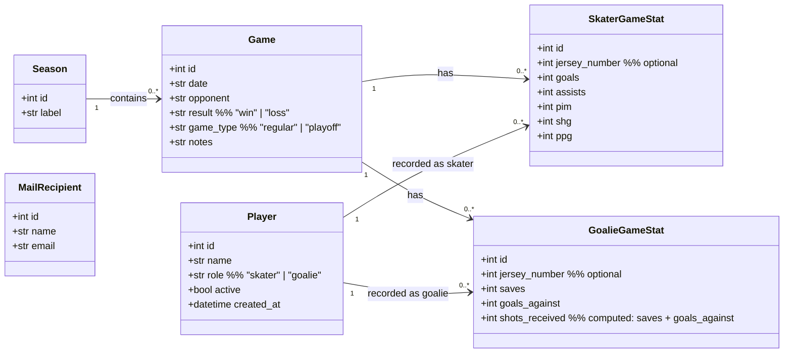

# Object Model — Class Diagram

## Notes

- `shots_received` on `GoalieGameStat` is always derived as `saves + goals_against`. It is stored for query performance but never entered by the user.
- `jersey_number` is per game stat line, not a player profile attribute. The same number may be reused across seasons or by substitute players.
- A `Player` has one primary `role`, but can appear in either `SkaterGameStat` or `GoalieGameStat` per game (exception role override).
- `MailRecipient` has no relationship to `Player`; the mailing list is managed independently.
